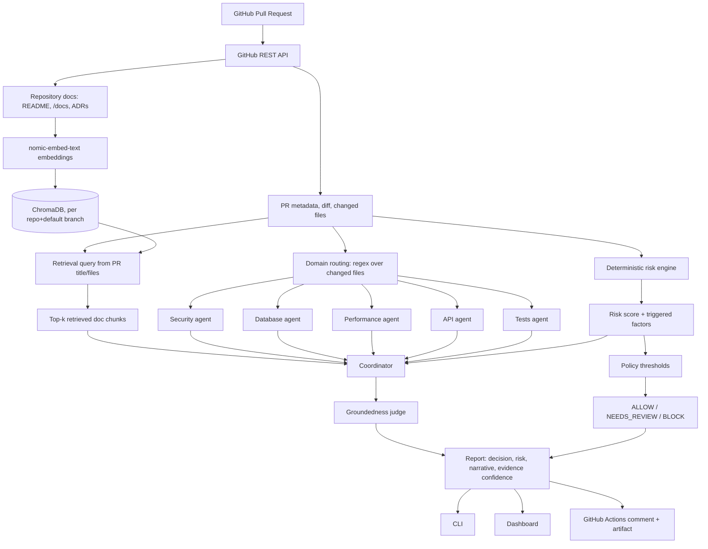

# PR Sentinel

PR Sentinel is a pull-request risk assessment system: a deterministic policy engine decides `ALLOW` / `NEEDS_REVIEW` / `BLOCK`, and a LangGraph pipeline of repository-grounded LLM specialists explains why.

**The LLM explains the risk. The deterministic policy engine decides the risk.** AI produces contextual evidence, specialist findings, and narrative explanation that are attached to the deterministic decision — it has no authority to change that decision.

```text
Deterministic path
  PR → heuristics → policy → ALLOW / NEEDS_REVIEW / BLOCK

AI path
  PR → RAG + specialists → coordinator → judge → narrative

Final report
  deterministic decision  +  AI narrative and specialist findings
```

The two paths are independent **with respect to release-decision authority** and run from the same PR data. The AI path may receive deterministic heuristic findings as context for its explanation, but it can never feed back into or override the release decision — the deterministic path is the only source of `ALLOW` / `NEEDS_REVIEW` / `BLOCK`. The AI path's output is attached to the report as supporting evidence and explanation.

---

## Why PR Sentinel?

Pull request review mixes two different kinds of judgment: signals that can be evaluated the same way every time (does this touch auth, does it change a schema, were tests deleted), and contextual engineering judgment that benefits from knowing the specific repository (its conventions, its architecture, what it documents about itself). Asking a single LLM call to produce both a risk number and an explanation collapses that distinction and makes the result hard to reproduce or audit.

PR Sentinel separates the two: a rule-based engine computes risk and the release decision with no model in the loop, and a set of LLM-based specialists — grounded in the target repository's own documentation — produce the explanation attached to that decision.

---

## At a glance

| Capability         | Implementation                                                      |
| ------------------ | ------------------------------------------------------------------- |
| Release decision   | Deterministic policy engine (`engine/policy.py`)                    |
| Risk scoring       | Weighted regex rules over changed files (`engine/heuristics.py`)    |
| AI analysis        | LangGraph specialist agents + coordinator (`engine/agents/`)        |
| Repository context | RAG over repository docs (`engine/rag/`)                            |
| Vector store       | ChromaDB, persisted locally, one collection per repo/default branch |
| Embeddings         | `nomic-embed-text` via Ollama                                       |
| Default LLM        | Ollama (`llama3.2` by default)                                      |
| Hosted LLMs        | Not implemented — Ollama is the only supported backend              |
| Backend            | FastAPI + Pydantic v2                                               |
| Dashboard          | React 18 + TypeScript, Vite, Tailwind                               |
| CLI                | `backend/cli.py` (Python, argparse)                                 |
| CI/CD              | GitHub Actions, self-contained (starts Ollama in the runner)        |
| Analysis history   | SQLite (`engine/history.py`)                                        |

---

## Architecture

The diagram above is the 10-second version. The full data flow — including RAG indexing and specialist routing — looks like this:



What talks to what:

* **GitHub REST API** supplies PR metadata, the diff, and the repository's file tree — the only external data source.
* **Deterministic risk engine** (`engine/heuristics.py`, `engine/policy.py`) turns changed files into a risk score and a release decision, independent of everything below it.
* **RAG** (`engine/rag/`) turns the repository's own docs into retrievable context so specialist prompts aren't reasoning over an isolated diff.
* **LangGraph specialists** (`engine/agent_routing.py`, `engine/agents/`) are routed deterministically by file path, then call Ollama to produce domain-specific observations.
* **Coordinator and judge** (`engine/agents/nodes.py`) synthesize those observations into a narrative and check it against the evidence it was given.
* **CLI, FastAPI backend, and GitHub Actions** all call the same `analyze_pr()` entry point (`engine/service.py`) and render the same report.

---

## How decisions are made

### Deterministic layer

`heuristics.analyze()` runs a fixed set of weighted, regex-based rules against a PR's changed files — for example, files under `auth/`, `login/`, or `session/` add 40 points; `payment/`, `billing/`, or `stripe/` add 45; a detected database migration adds 35; deleted test files add 25 (see `engine/heuristics.py` for the full rule set). The resulting 0–100 score is mapped to a release risk band and decision in `engine/policy.py`:

| Risk score | Release risk | Decision       |
| ---------- | ------------ | -------------- |
| `< 30`     | LOW          | `ALLOW`        |
| `30–59`    | MEDIUM       | `NEEDS_REVIEW` |
| `>= 60`    | HIGH         | `BLOCK`        |

This mapping is the **only** thing that determines `decision`. The CLI's exit code and the GitHub Actions pass/fail status are both derived from this field, never from anything the AI layer produces.

A separate, independently deterministic score — **review complexity** (`engine/review_complexity.py`) — estimates how much human review effort a PR requires (lines changed, files touched, subsystem spread, backend/frontend crossover, dependency churn), on the premise that review burden and release risk are different questions: a large documentation refactor can be high-complexity but low-risk.

A **production readiness score** (`engine/metrics.py`) is likewise computed deterministically from already-computed numbers, starting at 100 and applying arithmetic deductions for concrete readiness gaps such as risk, below-target confidence, missing tests, deployment complexity, documentation gaps, secrets, and dependency churn — it is not a model judgment.

`audit_llm_disagreement()` (`engine/policy.py`) separately compares the coordinator's own `overall_risk` read against the deterministic band and records the divergence on the report (`llm_disagreement`, with a direction: optimistic or pessimistic) purely for visibility — it never changes the release risk or decision.

### AI layer

Provides, and only provides:

* specialist-level findings (security, database, performance, API, tests)
* the report's narrative summary and architectural-impact description
* a rollout-strategy recommendation (Standard / Canary / Blue-Green / Manual Approval)
* a groundedness verdict on its own narrative

If the AI layer is unavailable, all deterministic outputs above — release risk, decision, review complexity, production readiness — are still computed and returned. The narrative falls back to a heuristics-only summary, while any specialist findings that were successfully computed remain attached to the report; failed specialists are recorded with their failure note rather than being treated as successful findings (see [AI failure and fallback behavior](#ai-failure-and-fallback-behavior)).

---

## RAG: how repository context works

RAG exists because specialist and coordinator prompts should reason about a PR in the context of the repository's own documented architecture and conventions, rather than only seeing an isolated diff.

```text
Repository documentation (README, CONTRIBUTING, SECURITY, architecture/design docs, docs/, ADRs)
        ↓
doc_fetcher.py — selects doc-like paths from the default branch, skips vendored/build dirs
        ↓
store.py — chunks each doc (800 chars, 100-char overlap)
        ↓
Ollama nomic-embed-text — embeds each chunk
        ↓
ChromaDB — persisted locally, one collection per repository/default branch
        ↓
Similarity query built from PR title, labels, and changed filenames
        ↓
Top-k chunks retrieved (RAG_TOP_K, default 5)
        ↓
Retrieved snippets included in the coordinator's prompt
```

* Up to `RAG_MAX_DOC_FILES` (default 12) doc files are indexed, each truncated to `RAG_MAX_DOC_CHARS` (default 4000) characters.
* The index is built from the repository's **default branch**. If a ChromaDB collection already exists for that repository/default branch, indexing is skipped and the existing index is queried directly — this is the "cache hit" reported in `execution_metrics.rag_cache_hit`.
* Both the embedding model and the vector store run locally; no repository content is sent to a third party as part of RAG.
* If no doc files are found, or the embedding call fails, RAG is skipped and the reason is recorded on the report (`rag.skip_reason`); the rest of the pipeline continues.

RAG surfaces what a repository has actually documented — it does not infer undocumented conventions, and retrieval can miss relevant context if the repository's docs don't cover it.

---

## LangGraph and specialist routing

LangGraph orchestrates role-specific LLM reviewers behind deterministic file/domain routing — the graph itself (`engine/agents/graph.py`) is a `StateGraph` with five specialist nodes running in parallel from `START`, all feeding a `coordinator` node, followed by a `judge` node before `END`. Which specialists actually run is decided entirely by regex matching against changed file paths (`engine/agent_routing.py`), with no LLM involved in that decision.

| Specialist        | Trigger (path pattern, examples)                                        | Purpose                                             |
| ----------------- | ----------------------------------------------------------------------- | --------------------------------------------------- |
| Security          | `auth/`, `login/`, `session/`, `payment/`, `stripe/`                    | Auth, secrets, payment-path changes                 |
| Database          | `alembic/`, `migrations/`, `*.sql`, `prisma/`, `entity/`, `repository/` | Schema/migration and persistence-layer risk         |
| Performance       | `cache/`, `redis/`, `queue/`, `worker/`, `benchmark/`                   | Hot paths, resource use                             |
| API Compatibility | `routes?/`, `controllers?/`, `api/`, `graphql/`, `endpoints?/`          | Endpoint additions/removals, contract compatibility |
| Test Coverage     | `tests?/`, `__tests__/`, `*.test.*`, `*.spec.*`                         | Missing coverage, deleted tests                     |

If a PR touches no files matching a domain, that specialist is skipped — no LLM call is made, and the report marks it `Skipped` rather than returning an empty result. Files shown to each specialist are ranked and capped (see [Context bounding](#context-bounding-and-large-prs)), and each specialist's output is validated against the evidence it was actually given before being included in the report.

The **coordinator** receives every specialist's findings, the deterministic heuristic factors, and the retrieved RAG context, and produces the narrative, rollout strategy, and risk-factor list. If it fails, its error is recorded and the specialists' already-computed findings are still included in the report. A judge then re-checks the coordinator's narrative against the same evidence and returns a groundedness verdict — a quality check on the explanation, not a second vote on the release decision.

### Implementation details: ranking, validation, and the judge's conflict rule

Matched files are ranked deterministically before being capped to the per-agent file limit — by keyword strength in the filename, then filename keyword presence, then lines changed, then patch size (`agent_routing.rank_files_for_domain`). The report distinguishes files actually reviewed from files matched but not shown.

Each specialist's raw JSON output is passed through `finding_validation.py`, which checks findings against the evidence it was actually given and demotes anything unverifiable to a separate `needs_verification` list instead of dropping it or presenting it with equal confidence.

The judge returns `grounded: true/false/null` plus any issues found (`null` = not evaluated, e.g. no synthesis to check, or `ENABLE_JUDGE=false`). If the judge reports issues but also claims `grounded: true`, the code forces `grounded: false` — the self-reported flag is not trusted over the issues list in the same response.

---

## Context bounding and large PRs

Local CPU inference makes prompt size a real constraint, so each specialist's context is explicitly bounded even though the deterministic engine evaluates the complete diff:

* `MAX_FILES_PER_AGENT` (default 4) — files shown to a single specialist, after ranking
* `MAX_PATCH_LINES` (default 30) and `MAX_PATCH_CHARS` (default 600) — per-file patch truncation

All three are configurable and read from `Settings` (`engine/config.py`). When a specialist's matched files exceed these limits, its prompt is told explicitly how many files/lines were withheld, and the report records `context_bounded: true` alongside the true count of files available versus files actually reviewed for that agent — the gap between "available" and "shown" is surfaced in the output rather than absorbed silently.

Bounding context makes local inference more predictable, but it does mean a specialist may not see every changed file in a very large PR. The deterministic risk score is unaffected by this limit, since it runs over the full diff before any bounding happens.

---

## LLM providers

### Ollama

Ollama is the only inference backend currently implemented (`engine/ollama_client.py`), for both chat completions and embeddings, and is the default local/private execution path — no repository content or PR data is sent externally when using it.

| Variable             | Default                  | Purpose                                        |
| -------------------- | ------------------------ | ---------------------------------------------- |
| `OLLAMA_BASE_URL`    | `http://localhost:11434` | Ollama server address                          |
| `OLLAMA_MODEL`       | `llama3.2`               | Chat model for specialists, coordinator, judge |
| `OLLAMA_EMBED_MODEL` | `nomic-embed-text`       | Embedding model for RAG                        |

`.env.example` sets `llama3.2` as the current default and also lists `llama3.1` (8B) as a stronger speed/quality balance, with larger models requiring more capable hardware. `llama3.2` is used as the CPU-friendly default and in CI.

### Hosted providers

Not currently supported. There is no API-key configuration in `Settings`, and no code path other than `ollama_client.py` for making a completion or embedding call.

---

## AI failure and fallback behavior

Every AI-dependent stage is wrapped so a failure there degrades the report rather than crashing the pipeline:

* **A specialist's** LLM call fails → that agent's finding is recorded with an explanatory `risk_note` and zero confidence; other specialists are unaffected.
* **The coordinator** fails → its error is captured and the pipeline falls back to `analyze_with_heuristics_only()`, which builds the narrative directly from deterministic factors. Specialist findings that were successfully computed remain in the report, while the response is flagged `ai_enabled: false` and the executive summary is prefixed with *"AI synthesis unavailable. Final release decision was produced by the deterministic policy engine."*
* **The judge** fails or is disabled → `grounded` is `null` ("not evaluated"), never silently reported as passing.
* **RAG** fails (embedding call down, no docs found) → analysis continues without repository context, with the reason recorded on the report.

In every case, release risk, review complexity, production readiness, and the `ALLOW`/`NEEDS_REVIEW`/`BLOCK` decision are still computed — AI availability is never a precondition for getting a decision.

Timeouts are per-call: 120s for a specialist, 180s for the coordinator, 120s for the judge (`chat_json`'s general default is 300s). A timeout raises `OllamaError` and is handled the same way as any other AI failure above. Large PRs can exceed the practical inference budget of a CPU-only runner; in that case PR Sentinel still produces the deterministic release assessment while marking AI synthesis as unavailable.

The CLI encodes the same distinction in its exit codes: `0` for a completed analysis resolving to `ALLOW`/`NEEDS_REVIEW`, `1` for a completed analysis resolving to `BLOCK`, and `2` for the analysis pipeline itself raising an unhandled exception. A `BLOCK` and a crash are never conflated.

---

## Example analysis lifecycle

```text
PR changes an API route and a CI workflow file
            ↓
Deterministic engine detects "Public API contract changed" and
"Infrastructure / deployment files changed" → risk score computed
            ↓
Score mapped to release risk + decision (policy.py)
            ↓
Path routing selects the API specialist;
other specialists run only if changed paths match their domains
            ↓
Repository docs relevant to the PR are retrieved via RAG
            ↓
Each routed specialist receives a ranked, bounded slice of its domain's diff
            ↓
Specialists return structured, validated findings
            ↓
Coordinator synthesizes heuristics + RAG context + specialist findings into a narrative
            ↓
Judge checks the narrative against the evidence and returns a groundedness verdict
            ↓
Report is rendered — decision remains exactly what the deterministic engine computed
```

---

## CLI

```bash
python backend/cli.py analyze \
  --repo owner/repository \
  --pr 123 \
  --output reports/report.json \
  --comment reports/report.md \
  --token "$GITHUB_TOKEN"
```

| Flag        | Required | Description                                                         |
| ----------- | -------- | ------------------------------------------------------------------- |
| `--repo`    | yes      | `owner/repo`                                                        |
| `--pr`      | yes      | Pull request number                                                 |
| `--output`  | no       | JSON report path, or `-` for stdout (default)                       |
| `--comment` | no       | Path to write a Markdown summary suitable for a PR comment          |
| `--token`   | no       | GitHub token; falls back to the `GITHUB_TOKEN` environment variable |

Exit codes: `0` (`ALLOW`/`NEEDS_REVIEW`), `1` (`BLOCK`), `2` (analysis error). If `--comment` is set and the run raises an exception, a short Markdown file explaining the failure is still written, so a CI comment step never posts nothing.

---

## Dashboard

`frontend/` is a React 18 + TypeScript app (Vite, Tailwind) that calls the FastAPI backend at `VITE_API_BASE_URL` (default `http://localhost:8000`). It renders the full report — decision, risk breakdown, specialist findings, evidence confidence, review queue, engineering metrics — plus analysis history and a repository-health view aggregated from `/api/history`. It requires the backend running locally, and Ollama running for a live (non-demo) analysis.

```bash
cd frontend
npm install
npm run dev
```

---

## GitHub Actions

PR Sentinel does not currently require a publicly hosted PR Sentinel backend for GitHub Actions. The workflow (`.github/workflows/pr-sentinel.yml`) executes the analysis directly inside the GitHub Actions runner, on `opened`, `reopened`, `synchronize`, and `ready_for_review`:

```text
Checkout repository
        ↓
Set up Python 3.12, install requirements-dev.txt
        ↓
Run deterministic backend tests (pytest engine/tests)
        ↓
Start Ollama in a Docker container on the runner
        ↓
Pull llama3.2 and nomic-embed-text, then send a warm-up request to each
        ↓
Run backend/cli.py analyze against the PR
        ↓
Upload reports/report.json + report.md as a workflow artifact
        ↓
Post report.md as a PR comment (always, regardless of analyze outcome)
        ↓
Map the CLI's exit code to workflow pass/fail
```

The final step is explicit about the distinction: exit `0` passes the workflow ("deterministic policy allowed the PR to proceed"); exit `1` (`BLOCK`) fails the workflow *intentionally*; any other exit code fails as an unexpected error. A blocked PR and a broken pipeline are never reported as the same kind of failure. `llama3.2` is used in CI specifically because GitHub-hosted runners are CPU-only with limited resources; the workflow comments note a self-hosted runner as the path to running a larger model.

---

## Local setup

### Prerequisites

* Python 3.12
* Node.js
* [Ollama](https://ollama.com), for local inference

### Clone

```bash
git clone https://github.com/PrateekaBhat/pr-sentinel.git
cd pr-sentinel
```

### Backend setup

```bash
cd backend
python -m venv .venv && source .venv/bin/activate   # .venv\Scripts\activate on Windows
pip install -r requirements.txt
cp .env.example .env   # optional — defaults work without it
```

### Frontend setup

```bash
cd frontend
npm install
```

### Ollama setup

```bash
ollama pull llama3.2
ollama pull nomic-embed-text
```

### Run

```bash
# Backend
cd backend && python -m pytest engine/tests -q && uvicorn app.main:app --reload

# Frontend (separate shell)
cd frontend && npm run dev

# Or, from the repository root, via Docker:
docker compose up
```

---

## Configuration

All settings are read from environment variables / `backend/.env` via `engine/config.py`.

| Variable                       | Purpose                                                                        | Default                  | Required |
| ------------------------------ | ------------------------------------------------------------------------------ | ------------------------ | -------- |
| `OLLAMA_BASE_URL`              | Ollama server address                                                          | `http://localhost:11434` | No       |
| `OLLAMA_MODEL`                 | Chat model for specialists, coordinator, judge                                 | `llama3.2`               | No       |
| `OLLAMA_EMBED_MODEL`           | Embedding model for RAG                                                        | `nomic-embed-text`       | No       |
| `GITHUB_TOKEN`                 | GitHub API token; raises the unauthenticated rate limit from 60/hr to 5,000/hr | *(empty)*                | No       |
| `CORS_ORIGINS`                 | Comma-separated origins allowed to call the API                                | `http://localhost:5173`  | No       |
| `RAG_ENABLED`                  | Toggles repository doc retrieval entirely                                      | `true`                   | No       |
| `CHROMA_PERSIST_DIR`           | On-disk path for the ChromaDB index                                            | `./chroma_data`          | No       |
| `RAG_MAX_DOC_FILES`            | Max repo doc files indexed                                                     | `12`                     | No       |
| `RAG_MAX_DOC_CHARS`            | Max characters read per doc file                                               | `4000`                   | No       |
| `RAG_TOP_K`                    | Chunks retrieved per analysis                                                  | `5`                      | No       |
| `MAX_FILES_PER_AGENT`          | Files shown to each specialist                                                 | `4`                      | No       |
| `MAX_PATCH_LINES`              | Patch lines shown per file                                                     | `30`                     | No       |
| `MAX_PATCH_CHARS`              | Patch characters shown per file                                                | `600`                    | No       |
| `ENABLE_JUDGE`                 | Whether the groundedness judge pass runs                                       | `true`                   | No       |
| `VITE_API_BASE_URL` (frontend) | Backend URL the dashboard calls                                                | `http://localhost:8000`  | No       |

All settings have defaults; environment variables are optional.

---

## Testing

`backend/engine/tests/` contains 109 tests across 16 files. Deterministic components — risk scoring (`test_risk_engine.py`, `test_policy.py`), file/domain classification (`test_category_classifier.py`), specialist context selection and bounding (`test_context_selection.py`), agent-output validation (`test_finding_validation.py`), report rendering (`test_report_renderer.py`), review complexity, the API contract (`test_api_contract.py`), fallback behavior when AI is unavailable (`test_fallback_and_config.py`), and end-to-end policy scenarios (`test_golden_architecture.py`) — are unit-tested directly, with no model call required. This matters for this architecture specifically: the code that owns the release decision is fully testable without Ollama running.

```bash
cd backend
python -m pytest engine/tests -q
```

This is also the first step in the GitHub Actions workflow, run before Ollama is started, so a deterministic-logic regression fails fast without waiting on model downloads. No coverage percentage is measured or reported by the project.

---

## Repository structure

```text
pr-sentinel/
├── backend/
│   ├── app/main.py       FastAPI app: /api/analyze, /api/history,
│   │                       /api/repository-health, /api/golden-tests, /api/demos
│   ├── engine/
│   │   ├── policy.py       deterministic risk band → release decision
│   │   ├── heuristics.py   weighted rule set producing the risk score
│   │   ├── agent_routing.py  domain patterns + file ranking for specialists
│   │   ├── agents/          LangGraph graph, node implementations, prompts
│   │   ├── rag/              doc fetching, chunking/embedding, ChromaDB, retrieval
│   │   ├── ollama_client.py  Ollama chat + embeddings client
│   │   ├── report_renderer.py  Markdown report rendering
│   │   ├── config.py        Settings (env-driven)
│   │   └── tests/            109 tests, no LLM required
│   ├── cli.py
│   └── requirements.txt
├── frontend/               React + TypeScript dashboard (Vite, Tailwind)
├── .github/workflows/pr-sentinel.yml
└── docker-compose.yml
```

---

## Design principles

* Deterministic policy owns the release decision; AI output can be recorded as disagreeing with it, but never overrides it.
* Specialist routing is deterministic file-path matching, not a model deciding what matters.
* Repository context is retrieved through RAG, not assumed or hardcoded per repository.
* Context shown to each AI stage is explicitly bounded, and the report states when bounding occurred rather than hiding it.
* AI failures are isolated from the deterministic release decision; when AI analysis is unavailable, the deterministic engine can still produce the release assessment.
* Local execution (Ollama, ChromaDB) is the default and only currently supported path.

---

## Limitations

* File-to-domain classification is regex/path-based, not static analysis — unconventional repository layouts can be misclassified.
* Only Ollama is currently supported as an inference backend; there is no hosted-provider (API-key) integration in the codebase today.
* CPU-only local Ollama inference can be slow, and large PRs can exceed a practical inference budget — this is a real constraint in the GitHub Actions environment specifically, since it runs on CPU-only, GitHub-hosted runners.
* Specialist context is bounded per PR; a specialist may not see every file in its domain on a very large PR (the deterministic score always does).
* RAG retrieval is limited to what a repository actually documents and can miss relevant context that exists but isn't written down.
* The current `no_tests` heuristic is intentionally conservative: it adds a small risk signal whenever a PR contains non-test files without touching tests. That means documentation-only PRs such as a `README.md` change can currently receive the `No test files touched` signal even though they do not modify executable code. This is a known heuristic limitation, not an AI decision.
* Documentation can still be operationally significant — for example, specifications, API documentation, architecture decisions, security guidance, or deployment documentation may affect engineering behavior without changing executable code. The current heuristic does not yet distinguish those cases from ordinary non-test changes.
* AI findings are probabilistic and validated on a best-effort basis (`finding_validation.py`); the groundedness judge is a qualitative verdict, not a calibrated statistical score.
* GitHub Actions currently executes the full analysis inside the workflow itself; there is no separately hosted PR Sentinel service.
* The dashboard requires the FastAPI backend (and, for a live analysis, Ollama) running locally — there is no hosted dashboard deployment.
* This is a review aid: it does not merge, deploy, canary, or roll back anything itself.

---

## Roadmap

* Support for at least one hosted, API-key-based LLM provider as an alternative to Ollama.
* Persisted, cross-run RAG index invalidation when repository documentation changes (currently indexed once per repository/default branch and reused).
* Configurable per-specialist model selection (e.g. a stronger model for the coordinator, a smaller one for routine specialists).
* Refine test-related risk heuristics so documentation-only and other non-executable changes are distinguished from executable code changes.

---
## Demos

### 1. GitHub Actions Workflow
Demonstrates PR analysis running directly in GitHub Actions, including the deterministic release decision, AI analysis, workflow status, and generated PR comment.


### 2. Dashboard
Demonstrates the PR Sentinel dashboard, including the release decision, risk breakdown, specialist findings, repository context, and engineering metrics.

https://github.com/user-attachments/assets/72c1b0fa-650d-478e-ae76-326db40bef9c

### 3. CLI
Demonstrates running PR Sentinel locally through the command-line interface and generating the analysis report.


---

## License

No license file is currently included in this repository.
